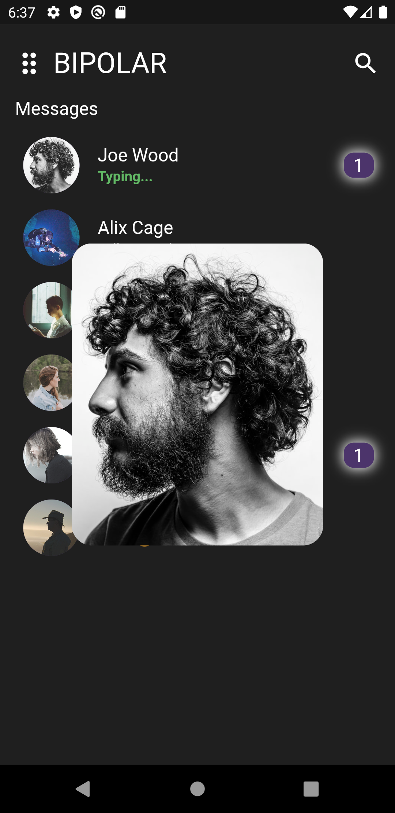
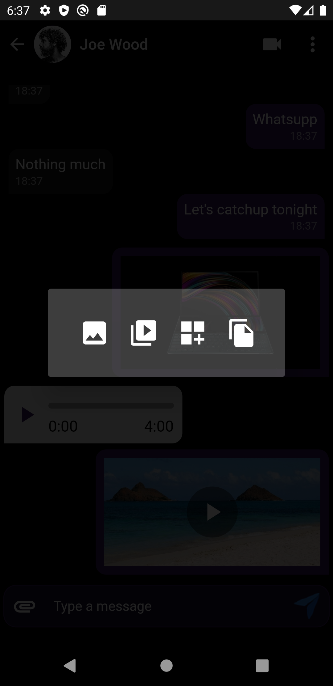

# Flutter-assignment
fork this repo and start your work on the flutter assigment 

# *Animated Splash Screen* 
 
 
 
# *Feed screen tap on user image to make it expand* 
 

# *Chat Screen*
 

  
<H1>Chat screen tap on attachment icon to see more options</H1>
 

